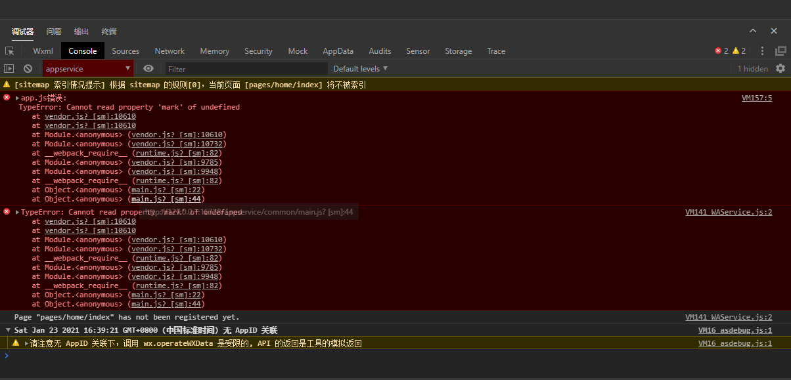
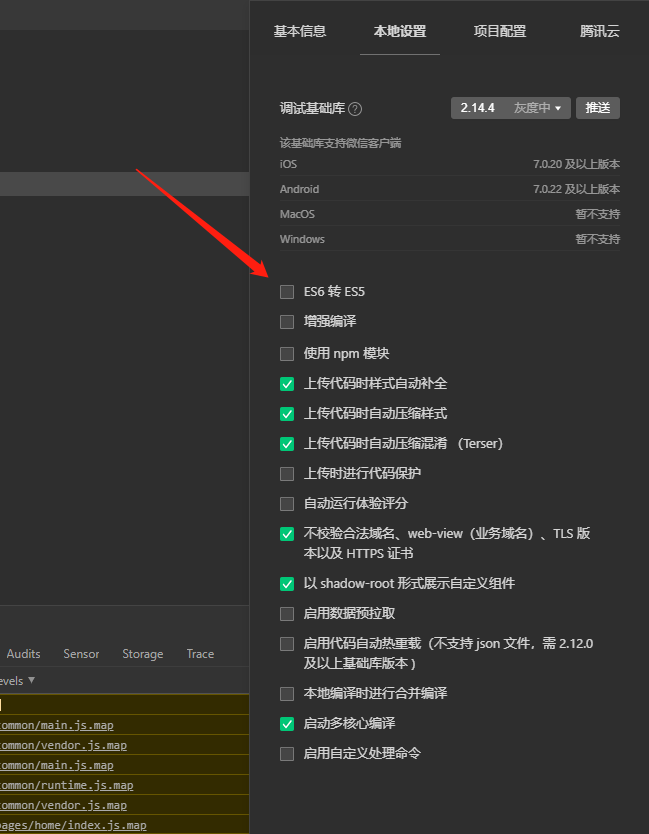

# UI 

## 选取原因

## 集成

### `Step1.` 安装

``` shell
$ yarn add uview-ui
```

### `Step2.` 配置

首先，在 `src/main.js` 文件中进行如下配置并引用

``` typescript
import uView from 'uview-ui';

Vue.use(uView);
```

配置 `scss` 主题文件，在 `src/uni.scss` 文件的头部增加引入：

``` scss
@import "uview-ui/theme.scss";
```

引入基础样式，在 `src/App.vue` 文件中引入如下内容：

``` vue
<style lang="scss">
@import 'uview-ui/index.scss';
</style>
```

最后配置 `easycom` 组件模式，**注意**：这里与官方文档不同，因为我们的框架为了使用 `vue` 的路由，魔改了一下， `pages.json` 文件是自动生成的！而官方是在 `pages.json` 文件中进行配置。

在 `src/router/index.js` 文件中加入如下配置：

``` javascript
module.exports = {
    easycom: {
        '^u-(.*)': 'uview-ui/components/u-$1/u-$1.vue'
    }
};
```

## 可能遇到的问题

在使用 `uView UI` 的时候，可能编译成小程序后遇到如下错误：



解决方法如下：


